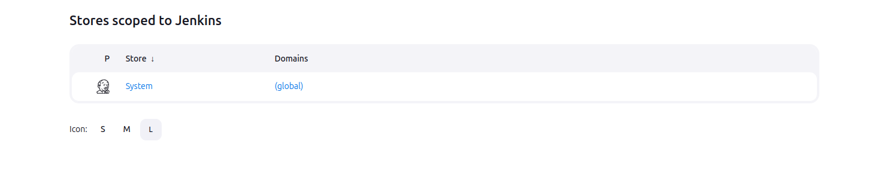

# Add Your Git Repository To Whanos Instance

## Table of content
- [SSH Requiest](#ssh-requiest)
- [Create Your Project](#create-your-project)
- [Authors](#authors)

## SSH Requiest
Before creating a project, you must add your private SSH key to the Jenkins instance by creating a corresponding credential for it. This will allow Jenkins to access the repositories specified in the jobs, provided the necessary permissions to the repositories are granted.

To do this, navigate to the `Dashboard` and go to the `Manage Jenkins` tab. Scroll down to the `Security` section and click on `Credentials`.

You should see something like this:

Then click on `System` -> `Global credentials (unrestricted)` -> `+ Add Credentials`.

Once on the page, select `SSH Username with private key` as the `Kind` and fill in the following fields:  

- **ID**: The identifier for the credential, which will be required when creating a job.  
- **Description**: A descriptive name (optional, for your reference).  
- **Username**: Your Git username.  
- **Treat username as secret**: Ensure this box is checked.  
- **Private Key**: Select `Enter directly`, click `Add`, and paste your private SSH key.  
- **Passphrase**: If your key is protected by a passphrase, enter it here.  

Finally, click **Create** to save the credential.

## Create Your Project

To link a Git repository to the Whanos architecture, you need to use the `link-project` job.

From the `Dashboard`, navigate to `link-project` and click on `Build with Parameters`.

Fill in the fields using the following guidelines:

- **DISPLAY_NAME**: The name your project will have within the Whanos infrastructure.  
- **SSH_URL**: The SSH URL of your Git repository (e.g., `git@github.com:Owner/Repo.git`).  
- **CREDENTIALS_ID**: The ID of the credential containing the SSH key you created (e.g., `git-ssh`).  

---

**NOTES**  

- If you haven’t created a credential for your SSH key yet, refer to **[SSH Requiest](#ssh-requiest)**.

- If script approval has not been completed beforehand, your job will automatically fail.
To approve the script and resolve this error, navigate to `Dashboard` -> `Manage Jenkins` -> `In-process Script Approval`. Review and approve the displayed script. Once approved, try linking or relinking your repository again.

---

If the job is successful, you will see your linked repository listed under the `Projects` folder on the `Dashboard`.

## Authors
**[Maxence Largeot](https://github.com/MaxenceLgt)**  
**[Arthur Doriel](https://github.com/MrMarmotte)**