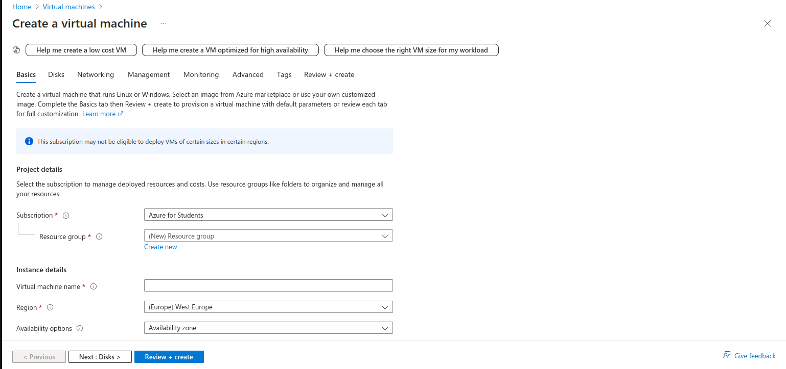
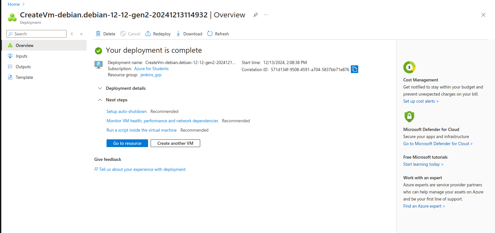

# Deploy Your Own Whanos Infrastructure

## Prerequisites  
- A Microsoft Azure account with sufficient credits to create and maintain an Azure virtual machine online.


## Table of Contents  

- [Create an Azure Virtual Machine](#create-an-azure-virtual-machine)
- [Set Up Whanos Requirements](#set-up-whanos-requirements)  
  - [Ansible Deployment Prerequisites](#ansible-deployment-prerequisites)  
  - [Jenkins Variables Configuration](#jenkins-variables-configuration)  
- [Deploy Your Whanos Infrastructure](#deploy-your-whanos-infrastructure)
- [Authors](#authors)  

## Create an Azure Virtual Machine
To deploy the Whanos infrastructure online, you first need to create an Azure Virtual Machine, as the deployment process is designed to work specifically with Azure.

To do so, connect to your Azure account, go to the `Virtual Machine` section, and click on `Create` -> `Azure virtual machine`.  
You should see something like this:  


On the first page, fill in the following fields:  
- `Resource group`: Create one if you don't already have one, or select the group you want it to belong to.  
- `Virtual machine name`: The name to assign to your virtual machine.  
- `Region`: Choose the Azure region that best suits you and your customers. Note that not all VM sizes are available in all regions.  
- `Image`: Select **Debian 12 "Bookworm" - x64 Gen2**.  
- `VM Architecture`: Select **x64**.  
- `Username`: The username you will use to connect via SSH to your virtual machine.  
- `SSH public key source`: Select **Use existing public key**.  
- `SSH public key`: Provide your SSH public key.  
- `Select inbound ports`: Tick **SSH (22)** and **HTTP (80)**.  

---

**Note**  
- All values not mentioned should remain as default.  

---

Once these values are filled, click on `Review + Create` and then `Create`. When your virtual machine is fully deployed, you should see something like this:  


---

**Notes**  
For Ansible deployment, you will need to store two pieces of information from your newly created virtual machine:  

- **Username**: The username you specified when creating the machine.  
- **Public IP**: The public IP address of the virtual machine. You can find it by clicking the `Go to resource` button or by accessing your virtual machine settings from the Azure home page.  

---  

## Set Up Whanos Requirements

Before setting up the requirements for Whanos, ensure you have the Whanos infrastructure files available on your local machine.

### Ansible Deployment Prerequisites

To deploy your infrastructure on the newly created VM, we will use `ansible-playbook`.

Before running the playbook, certain variables need to be configured in the project files.

In the file `jenkins/production.yml`, complete the fields according to the following guidelines:

- **ansible_host**: The public IP address of your machine.  
- **ansible_port**: SSH connection port (22).  
- **ansible_ssh_user**: The username configured on your VM.  
- **ansible_ssh_private_key_file**: Path to your private SSH key file.  

Once these Ansible variables are properly configured and after configuring Jenkins variables, you can deploy the infrastructure online by executing command given in [Deploy Your Whanos Infrastructure](#deploy-your-whanos-infrastructure)


### Jenkins Variables Configuration

To properly set up Jenkins, you will first need to configure a few variables.

To create images in a Docker registry, you must provide your credentials in `jenkins/roles/jenkins/files/linkproject.sh` under the respective variables: **DOCKER_USERNAME** and **DOCKER_PASSWORD**.

Finally, to set the password for your administrator account, specify the desired password in the file `jenkins/roles/jenkins/vars/main.yml` under the **ADMIN_PASSWORD** field. The password will be applied once the infrastructure is deployed.

## Deploy Your Whanos Infrastructure

To deploy the infrastructure on the virtual machine, run the following command:

```sh
ansible-playbook -i jenkins/production.yml jenkins/playbook.yml
```

Once completed, you can access your Jenkins instance using the public IP address of your virtual machine.

As an administrator, to prevent potential job failures, make sure to approve the script from the Jenkins interface by navigating to:  
`Manage Jenkins` -> `In-process Script Approval` -> `Approve`.

## Authors
**[Maxence Largeot](https://github.com/MaxenceLgt)**  
**[Arthur Doriel](https://github.com/MrMarmotte)**